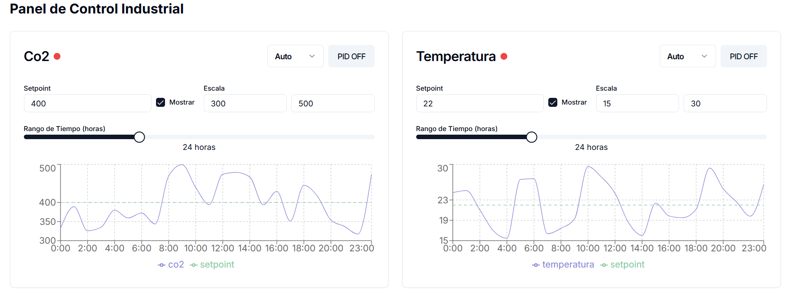

# Proyecto de Control PID

Este proyecto es una aplicación web que permite visualizar y controlar datos de un sistema PID. Utiliza Flask para el backend y React para el frontend.

## Requisitos Previos

Asegúrate de tener instalados los siguientes programas en tu máquina:

- [Python 3.x](https://www.python.org/downloads/)
- [Node.js](https://nodejs.org/en/download/)
- [npm](https://www.npmjs.com/get-npm) (se instala automáticamente con Node.js)

## Estructura del Proyecto
/tu_proyecto
│
├── backend
│ ├── app.py
│ └── pid_controls.db # Este archivo se creará automáticamente
│
└── frontend
├── package.json
└── ... (tu código frontend aquí)


## Instalación

### 1. Configuración del Backend

1. Navega a la carpeta del backend:

   ```bash
   cd backend
   ```

2. Crea un entorno virtual (opcional pero recomendado):

   ```bash
   python -m venv venv
   ```

3. Activa el entorno virtual:

   - En Windows:

     ```bash
     venv\Scripts\activate
     ```

   - En macOS/Linux:

     ```bash
     source venv/bin/activate
     ```

4. Instala las dependencias del backend:

   ```bash
   pip install Flask Flask-SQLAlchemy Flask-CORS
   ```

5. Ejecuta el backend:

   ```bash
   python app.py
   ```

   El backend debería estar corriendo en `http://127.0.0.1:5000`.

### 2. Configuración del Frontend

1. Navega a la carpeta del frontend:

   ```bash
   cd frontend
   ```

2. Instala las dependencias del frontend:

   ```bash
   npm install
   ```

3. Ejecuta el frontend:

   ```bash
   npm start
   ```

   El frontend debería abrirse en tu navegador en `http://localhost:3000`.

## Uso

1. **Visualización de Datos:**
   - Una vez que ambos servidores estén en funcionamiento, podrás ver el panel de control en el navegador.
   - Puedes seleccionar un rango de fechas para visualizar los datos de los controles PID.

2. **Interacción:**
   - Los gráficos se actualizarán automáticamente según los datos obtenidos del backend.

## Notas

- Asegúrate de que el backend esté corriendo antes de intentar acceder al frontend.
- Si realizas cambios en el backend, es posible que necesites reiniciar el servidor para que los cambios surtan efecto.

## Contribuciones

Si deseas contribuir a este proyecto, siéntete libre de hacer un fork y enviar un pull request.

## Licencia

Este proyecto está bajo la Licencia MIT. Consulta el archivo LICENSE para más detalles.

